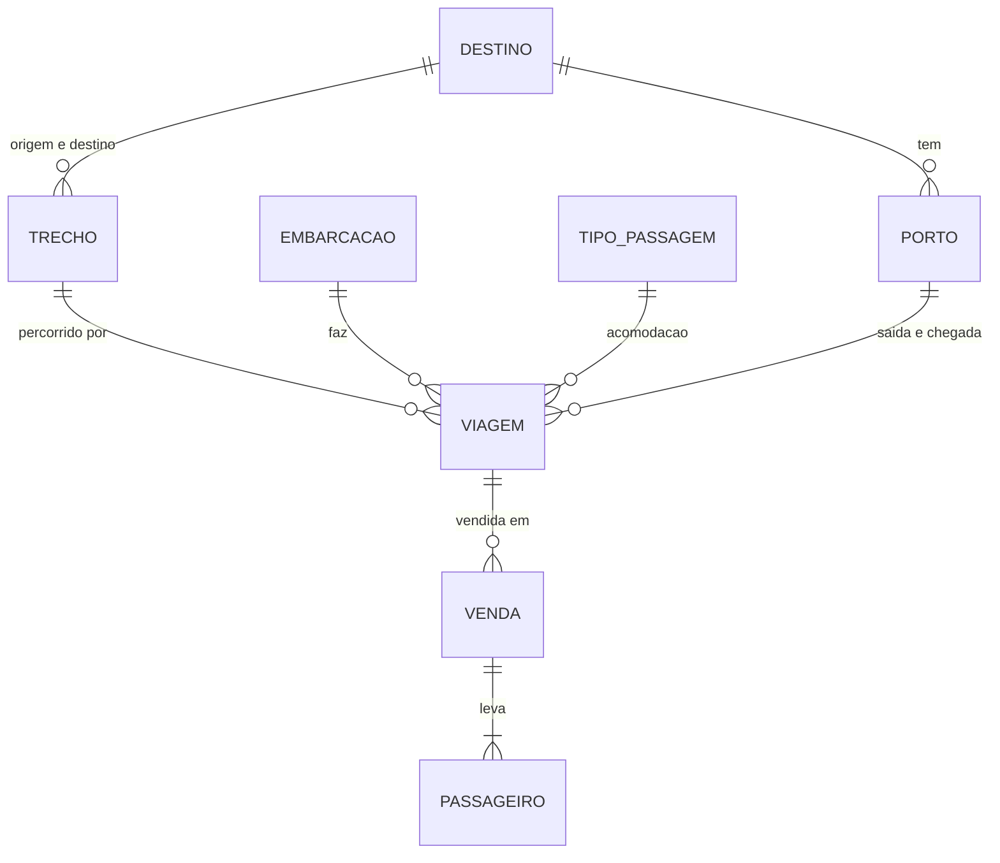

<Badge icon="circle-check" color="green">Disponível</Badge>

Antes de integrar, entenda como a iBarco modela uma viagem de barco. O ponto que mais confunde: **cada acomodação de uma mesma saída é uma viagem diferente**.

## Entidades

| Entidade | O que é | Campos principais |
|---|---|---|
| **Destino** | Uma cidade atendida (Belém, Santarém, Manaus...). | `id`, `nome`, `foto` |
| **Porto** | Cais ou terminal de embarque dentro de uma cidade. | `porto_id`, `porto` (nome), `cidade_id`, `cidade`, endereço, `latitude`, `longitude` |
| **Trecho** | Par origem → destino entre duas cidades. | `id`, `origem`, `destino`, `origem_nome`, `destino_nome`, `valor_apartir` |
| **Embarcação** (barco) | O navio que faz a viagem. | `id`, `nome_embarcacao`, `capacidade`, `comodidades`, `politica_preco`, `galeria` |
| **Tipo de passagem** (acomodação) | Rede, Suíte, Poltrona, Camarote... | `id`, `tipo`, `usa_assento`, `pessoas_por_unidade`, `antecedencia_minima_dias`, `antecedencia_minima_horas` |
| **Viagem** | Uma saída vendável: trecho + embarcação + data e hora + portos + **uma** acomodação + preço. | `id`, `trecho`, `embarcacao`, `data_saida`, `horario_saida`, `tipo_passagem`, `price`, `desconto`, `preco_final`, `avaliable_seats` |
| **Venda** | A compra de uma viagem para um ou mais passageiros. | `id`, `viagem`, `passengers`, `valor_final`, `status_reserva` |



### Uma acomodação, uma viagem

O barco *Comandante Exemplo* sai de Belém para Santarém em 20/11/2026 às 18:00. Ele vende rede, poltrona e suíte. Na API isso aparece como **três viagens**, cada uma com seu `id`, seu `tipo_passagem` e seu `price`:

| `id` | `tipo_passagem.tipo` | `price` |
|---|---|---|
| 90311 | Rede | 250.00 |
| 90312 | Poltrona | 320.00 |
| 90313 | Suíte | 1100.00 |

O passageiro escolhe a acomodação quando você envia o `id` da viagem certa na compra. Para listar as acomodações de uma saída, use [`GET /viagem/acomodacoes/`](/busca#acomodações-de-uma-saída).

## Ida e volta

Cada venda é de **uma viagem**: um trecho, uma saída, uma acomodação. A API não tem vínculo entre ida e volta: não existe campo que ligue duas vendas nem criação das duas de uma vez.

Ida e volta são **duas vendas independentes**:

| | Ida | Volta |
|---|---|---|
| Criação | `POST /vendas` com a `viagem` da ida. | Outro `POST /vendas`, com a `viagem` da volta (trecho invertido, outra data). |
| Cobrança | Uma cobrança com o `id` da venda. | Outra cobrança, com o `id` da outra venda. |
| Cancelamento | `POST /venda/cancelamento/{venda_id}` com o `id` da ida. | O mesmo caminho, com o `id` da volta. Cancelar uma não cancela a outra. |
| Status e token | `status_reserva` e `token_acesso` próprios. | Próprios. |
| Cupom | Aplicado sobre o subtotal desta venda. | Aplicado só se você enviar o código nesta venda também. |

A retenção do cancelamento também é por venda: ela conta o tempo que falta para a saída **daquela** viagem.

Como agrupar do seu lado:

<Steps>
  <Step title="Guarde um identificador de pedido">
    Crie o seu próprio identificador de ida e volta e guarde nele os dois `id` de venda e os dois `token_acesso`.
  </Step>
  <Step title="Busque a volta separadamente">
    Faça uma busca nova, com origem e destino trocados e a data da volta. Veja [Busca](/busca).
  </Step>
  <Step title="Crie as duas vendas">
    São duas chamadas. Se a segunda falhar, decida no seu sistema se mantém a primeira ou a cancela.
  </Step>
  <Step title="Confirme o pedido quando as duas estiverem pagas">
    Cobre cada venda e trate o pedido como confirmado só quando as duas estiverem `CONFIRMED`.
  </Step>
  <Step title="Mostre os valores por venda">
    O total do pedido é a soma dos dois `valor_final`. Deixe claro ao cliente que cada trecho se cancela à parte.
  </Step>
</Steps>

## Preço

O cálculo é sempre feito pela API. Use os valores que ela devolve e não remonte a conta no seu sistema: assim o valor exibido bate com o valor cobrado.

Para cada passageiro:

```text
desconto_total   = desconto da viagem (%) + desconto da faixa etária (%), limitado entre 0 % e 100 %
preco_passageiro = price × (1 − desconto_total / 100) × (1 + taxa de serviço / 100)
```

- `price` é a tarifa cheia da viagem.
- `desconto` é a promoção da viagem, em %.
- O desconto da faixa etária vem da política da embarcação (veja abaixo).
- A **taxa de serviço** é global, em %. Consulte em `GET /global-tax-percentual/1`.

O total da venda é a soma dos passageiros. Um cupom de desconto, quando houver, é aplicado sobre esse subtotal.

### Exemplo

Viagem com `price` 250.00, sem promoção, taxa de serviço de 20 %, criança com 50 % de desconto e idoso com 20 %:

| Passageiro | Desconto | Conta | Preço |
|---|---|---|---|
| Adulto | 0 % | 250.00 × 1.00 × 1.20 | 300.00 |
| Criança | 50 % | 250.00 × 0.50 × 1.20 | 150.00 |
| Idoso | 20 % | 250.00 × 0.80 × 1.20 | 240.00 |

Dois adultos e uma criança: 300.00 + 300.00 + 150.00 = **750.00**.

### Desconto de 100 %

O desconto de 100 % está em vigor: a API aceita e aplica. Ele não vale para toda venda. Só aparece quando uma destas fontes chega a 100 %:

| Fonte | Quem define | Onde aparece |
|---|---|---|
| Faixa etária da embarcação | Cadastro da embarcação (`politica_preco`, campo `discount`, em % por `pax_type`). O parceiro só consulta, em `GET /politica-faixa-etaria/`. | `faixas_etarias[].desconto` e `preco` da viagem; `discount`, `price_with_discount` e `total` do passageiro. |
| Promoção da viagem | Campo `desconto` da viagem, em %. | `desconto` da viagem; soma com o da faixa. |
| Cupom | Cupom percentual de 100 %, cadastrado pela iBarco. | `cupom_codigo`, `desconto_cupom` e `valor_final` da venda. |

Como a conta funciona:

- **É por passageiro.** O desconto da viagem e o da faixa são somados e limitados a 100 %. Passou de 100, o passageiro paga R$ 0,00: o desconto nunca vira crédito. Os outros passageiros da mesma venda pagam normalmente.
- **A taxa de serviço vem depois.** Ela incide sobre o preço já com desconto, então o passageiro com 100 % paga R$ 0,00, taxa incluída.
- **A faixa vem da idade.** Recebe o desconto da faixa quem a idade classifica nela (veja [Faixas etárias](/conceitos#faixas-etárias)). O passageiro isento continua na lista `passengers`, com `born_date`, documento e `pax_type` corretos.
- **Cupom de 100 % zera a compra.** O desconto do cupom é limitado ao subtotal: o total fica `0.00`, nunca negativo. Vale o mesmo para cupom de valor fixo igual ou maior que o subtotal.

Exemplo: viagem com `price` 250.00, taxa de serviço de 20 % e faixa `CH` cadastrada com 100 %. Dois adultos e uma criança:

| Passageiro | Desconto | Conta | Preço |
|---|---|---|---|
| Adulto | 0 % | 250.00 × 1.00 × 1.20 | 300.00 |
| Adulto | 0 % | 250.00 × 1.00 × 1.20 | 300.00 |
| Criança | 100 % | 250.00 × 0.00 × 1.20 | 0.00 |

Total da venda: **600.00**. Na lista de faixas da viagem e no passageiro:

```json
{"pax_type": "CH", "rotulo": "Criança", "idade_min": 0, "idade_max": 11, "desconto": 100.0, "preco": 0.0, "cadastrada": true, "politica_id": 12}
```

```json
{"first_name": "Lucas", "pax_type": "CH", "discount": "250.00", "service_tax": "0.00", "base_price": "250.00", "price_with_discount": "0.00", "total": "0.00"}
```

<Warning>
**Venda com valor total 0,00**

Se a venda inteira fecha em `0.00` (todos os passageiros isentos ou cupom de 100 %), `POST /venda/stripe-checkout/{venda_id}` responde `400` com `{"error": "Valor da venda inválido para pagamento."}`. Os outros caminhos de cobrança não têm tratamento próprio para valor zero. Antes de vender uma viagem totalmente gratuita, combine o fluxo com contato@ibarco.com.br.
</Warning>

### Taxa de serviço

#### `GET /global-tax-percentual/1`

Devolve o percentual vigente. O número no caminho é fixo (`1`): a API sempre devolve a configuração atual.

```bash
curl https://sandbox-api.ibarco.com.br/api/global-tax-percentual/1 \
  -H "X-Api-Key: SUA_CHAVE_DE_API"
```

Resposta `200`:

```json
{
  "value": 20
}
```

Erro `404` com `{"detail": "Nenhum valor de GlobalTaxPercentual encontrado."}` se a configuração não existir.

### Campos de preço na viagem

| Campo | Significado |
|---|---|
| `price` | Tarifa cheia, sem taxa. |
| `preco` | O mesmo `price`, como texto com duas casas. |
| `desconto` | Promoção da viagem, em %. |
| `taxa_servico` | Valor da taxa, em R$, para um adulto. |
| `preco_final` | Preço de um adulto com promoção e taxa. É o valor a exibir. |
| `preco_original_final` | Preço de um adulto sem promoção, com taxa. Serve de valor "de" riscado. |
| `faixas_etarias` | Preço por faixa etária, já com tudo aplicado. |
| `resumo_pax` | Total do grupo, quando você envia `adultos`, `criancas` e `idosos` na busca. |

<Note>
**Valores monetários**

A API devolve valores em reais (BRL) com duas casas decimais. Conforme o endpoint, um campo de valor chega como texto (`"300.00"`) ou como número (`300.0`). Converta sempre para decimal no seu sistema e aceite os dois formatos.
</Note>

## Faixas etárias

| `pax_type` | Faixa | Regra de idade |
|---|---|---|
| `CH` | Criança | idade **menor que** o limite de criança |
| `AD` | Adulto | entre os dois limites |
| `SR` | Idoso | idade **maior ou igual** ao limite de idoso |

Os limites vêm da política de preço da embarcação (`years` em `politica_preco`):

- Para `CH`, `years` é o limite superior **exclusivo**. Com `years = 12`, quem tem 11 anos é criança e quem tem 12 é adulto.
- Para `SR`, `years` é o limite inferior **inclusivo**. Com `years = 60`, quem tem 60 anos é idoso.
- Se a embarcação não cadastrou a faixa, vale um limite padrão do sistema (**12** para criança e **60** para idoso, salvo outro cadastro geral). Use `faixas_etarias`, que já traz os limites aplicados.

O desconto de cada faixa é cadastrado por embarcação. Não existe regra fixa: uma embarcação pode dar 100 % para criança e outra, 50 %. O desconto de 100 % está em vigor: veja [Desconto de 100 %](/conceitos#desconto-de-100-%).

**Como a idade é calculada:** ano atual − ano de nascimento, sem considerar o dia do aniversário. Quem nasceu em 15/12/2014 conta como 12 anos durante todo o ano de 2026.

A API recusa com `400` o passageiro cujo `pax_type` não bate com a idade. Para não errar, use o campo `faixas_etarias` da viagem para escolher o `pax_type`: ele já traz `idade_min` e `idade_max` de cada faixa.

```json
"faixas_etarias": [
  {"pax_type": "CH", "rotulo": "Criança", "idade_min": 0, "idade_max": 11, "desconto": 50.0, "preco": 150.0, "cadastrada": true, "politica_id": 12},
  {"pax_type": "AD", "rotulo": "Adulto", "idade_min": 12, "idade_max": 59, "desconto": 0.0, "preco": 300.0, "cadastrada": false, "politica_id": null},
  {"pax_type": "SR", "rotulo": "Idoso", "idade_min": 60, "idade_max": null, "desconto": 20.0, "preco": 240.0, "cadastrada": true, "politica_id": 13}
]
```

`cadastrada: false` indica que a faixa usa o padrão do sistema, não um cadastro da embarcação. `idade_max: null` significa sem limite.

Se a compra for recusada por idade, ajuste o `pax_type` conforme a mensagem de erro.

### Regra de idade unificada

<Badge icon="clock" color="orange">Em breve</Badge>

A validação do `pax_type` na compra usa a política da embarcação da viagem, a mesma de `faixas_etarias`. A idade é calculada por ano: ano atual menos ano de nascimento. Use `faixas_etarias` para escolher o `pax_type` de cada passageiro.

## Trava de antecedência

Cada acomodação tem uma antecedência mínima de compra (`antecedencia_minima_dias` + `antecedencia_minima_horas`). Exemplo: rede vende até 3 horas antes da saída; suíte fecha 15 dias antes.

Quando falta menos que isso para a partida, a viagem **sai da busca** e a compra é recusada. Isso evita vender uma passagem que o barco não consegue mais emitir.

O detalhe da viagem (`GET /viagens/{id}/`) informa:

| Campo | Exemplo |
|---|---|
| `disponivel_para_venda` | `false` |
| `motivo_indisponivel` | `"As passagens de Suíte para esta viagem precisam ser compradas com 15 dias de antecedência. O prazo para esta saída já encerrou."` |

Viagem que já partiu: `"Esta viagem já partiu e não está mais disponível para compra."`

## Vagas

O campo `avaliable_seats` (com essa grafia) é a capacidade cadastrada para a viagem. Ele **não** é um saldo que diminui a cada venda. Valores `0` ou `null` significam "não informado". Veja [Reserva de vaga e expiração](/reserva-de-vaga) para o que está planejado.

## Status da venda

| `status_reserva` | Significado |
|---|---|
| `CREATED` | Venda criada, aguardando pagamento. |
| `PENDING` | Mesmo significado de `CREATED`. Trate os dois da mesma forma. |
| `CONFIRMED` | Pagamento confirmado pelo gateway. Bilhete enviado ao comprador. |
| `CANCELED` | Venda cancelada. |
| `EXPIRED` | <Badge icon="calendar" color="purple">Planejado</Badge> Prazo de pagamento venceu e a vaga foi liberada. |

Novos status podem surgir (veja a [política de versionamento](/index#política-de-versionamento)). Trate um valor desconhecido como "aguardando pagamento".
