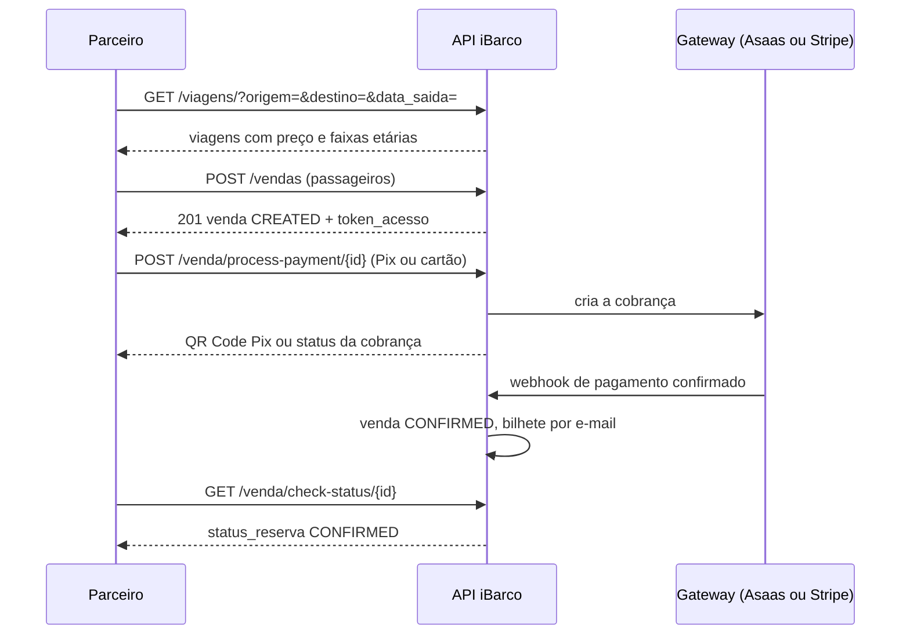

<Badge icon="circle-check" color="green">Disponível</Badge>

A API iBarco permite que agências, operadoras e outros parceiros vendam passagens fluviais da Amazônia dentro dos próprios sistemas. Com ela você consulta cidades, portos, embarcações e saídas, calcula o preço por passageiro, cria a venda e cobra o cliente por Pix ou cartão.

É a mesma API que move o site [ibarco.com.br](https://ibarco.com.br). Tudo o que o site faz na busca e no checkout está ao seu alcance.

<Columns cols={2}>
  <Card title="Primeiros passos" icon="rocket" href="/primeiros-passos">
    Da credencial à primeira venda confirmada, em cinco etapas.
  </Card>
  <Card title="Referência de endpoints" icon="list" href="/referencia">
    Todos os endpoints, com autenticação e status.
  </Card>
</Columns>

## Para quem é

- Agências e operadoras que querem oferecer passagens iBarco no próprio site ou balcão.
- Integradores que montam canais de venda (aplicativos, chatbots, totens).
- Equipes técnicas que precisam consultar o estado de uma venda.

Esta documentação assume que você conhece HTTP, JSON e chamadas `curl`. Todos os exemplos usam dados fictícios.

## Ambientes

| Ambiente | URL base | Observação |
|---|---|---|
| Sandbox | `https://sandbox-api.ibarco.com.br/api` | Ambiente de integração e testes. Todos os exemplos desta documentação usam esta URL. |
| Produção | Informada junto com as credenciais de produção. | Vendas e cobranças reais. |

Todos os caminhos desta documentação são relativos à URL base. Exemplo: `GET /viagens/` significa `GET https://sandbox-api.ibarco.com.br/api/viagens/`.

Use sempre HTTPS. Datas seguem o formato `AAAA-MM-DD` e horários `HH:MM:SS`, no horário de Brasília (UTC−3).

## Como pedir credenciais

Escreva para **contato@ibarco.com.br** com:

1. Razão social e CNPJ da empresa.
2. Nome e e-mail do responsável técnico.
3. Como você pretende usar a API (canal de venda, volume estimado).
4. Para quais ambientes você precisa de credenciais (sandbox, produção).

Você recebe uma **chave de API exclusiva**. Veja como usá-la em [Autenticação](/autenticacao).

## Suporte técnico

Escreva para **contato@ibarco.com.br**. Ao relatar um problema, informe o método, o caminho, o horário aproximado da chamada, o status HTTP e o corpo da resposta. Nunca envie a sua chave de API por e-mail.

## Política de versionamento

- **Mudanças compatíveis** podem entrar a qualquer momento: novos endpoints, novos campos na resposta, novos parâmetros opcionais, novos valores de status. Escreva o seu cliente para ignorar campos que ele não conhece.
- **Mudanças incompatíveis** (remover ou renomear campo, mudar tipo, mudar o significado de um status, passar a exigir um parâmetro) são avisadas por e-mail aos parceiros com **30 dias de antecedência** e registradas no [Changelog](/changelog).

## Estado da API

Cada recurso tem um selo de status no topo da sua página ou seção:

- <Badge icon="circle-check" color="green">Disponível</Badge> em produção, pode usar.
- <Badge icon="calendar" color="purple">Planejado</Badge> desenho proposto. Valores e detalhes podem mudar antes da entrega.

| Recurso | Status | Página |
|---|---|---|
| Autenticação por chave de API e Bearer (JWT) | <Badge icon="circle-check" color="green">Disponível</Badge> | [Autenticação](/autenticacao) |
| Busca: destinos, portos, embarcações, rotas, datas, viagens, acomodações | <Badge icon="circle-check" color="green">Disponível</Badge> | [Busca](/busca) |
| Preço por faixa etária e taxa de serviço | <Badge icon="circle-check" color="green">Disponível</Badge> | [Conceitos](/conceitos#preço) |
| Regra de idade unificada pela política da embarcação | <Badge icon="circle-check" color="green">Disponível</Badge> | [Conceitos](/conceitos#regra-de-idade-unificada) |
| Criação de venda | <Badge icon="circle-check" color="green">Disponível</Badge> | [Compra](/compra) |
| Campos protegidos na criação da venda (status, total, vendedor) | <Badge icon="circle-check" color="green">Disponível</Badge> | [Compra](/compra#campos-ignorados-na-criação) |
| Validação de cupom | <Badge icon="circle-check" color="green">Disponível</Badge> | [Compra](/compra#validar-cupom) |
| Validação estrita de quantidades por faixa etária | <Badge icon="circle-check" color="green">Disponível</Badge> | [Compra](/compra#passageiros-e-contadores) |
| Idempotência (`Idempotency-Key`) | <Badge icon="circle-check" color="green">Disponível</Badge> | [Compra](/compra#idempotência) |
| Emissão, troca e revogação da chave de API; segredo, teste e reenvio de webhook | <Badge icon="circle-check" color="green">Disponível</Badge> | [Autenticação](/autenticacao#troca-de-chave) |
| Pagamento: link Asaas, Pix, cartão, Stripe | <Badge icon="circle-check" color="green">Disponível</Badge> | [Pagamento](/pagamento) |
| Consulta de status da venda | <Badge icon="circle-check" color="green">Disponível</Badge> | [Pagamento](/pagamento#acompanhar-a-confirmação) |
| Token da venda obrigatório em cobrança, cancelamento e status | <Badge icon="circle-check" color="green">Disponível</Badge> | [Pagamento](/pagamento#acesso-à-venda) |
| Valores de `metodo_pagamento` padronizados | <Badge icon="circle-check" color="green">Disponível</Badge> | [Pagamento](/pagamento#método-de-pagamento-gravado) |
| Cancelamento com prévia, faixas de retenção e estorno automático | <Badge icon="circle-check" color="green">Disponível</Badge> | [Cancelamento](/cancelamento) |
| Reserva de vaga e expiração da venda | <Badge icon="circle-check" color="green">Disponível</Badge> | [Reserva de vaga](/reserva-de-vaga) |
| Webhooks de saída para o parceiro | <Badge icon="circle-check" color="green">Disponível</Badge> | [Webhooks](/webhooks) |
| Limite de requisições | <Badge icon="circle-check" color="green">Disponível</Badge> | [Erros e limites](/erros#limite-de-requisições) |

Atualizado em 09/10/2026.

## Fluxo de venda em uma tela

